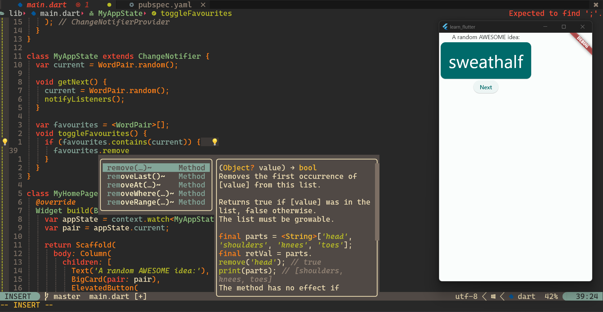

<!--  -->



# for fresh install on new machine

prerequisites (install using [scoop](https://scoop.sh)):

- zig (to compile treesitter parsers)
- [fzf](https://github.com/junegunn/fzf) (for telescope)
- [ripgrep](https://github.com/BurntSushi/ripgrep) (for fzf to respect
  .gitignore so that telescope doesn't show ignored folders)

---

1. [Download Packer](https://github.com/wbthomason/packer.nvim#quickstart)
   <br><br>
   ```powershell
   git clone https://github.com/wbthomason/packer.nvim "$env:LOCALAPPDATA\nvim-data\site\pack\packer\start\packer.nvim"
   ```
2. Clone this nvim config repo into the local nvim config folder by
   <br><br>
   ```powershell
   git clone https://github.com/devpandaz/nvim.git "$env:LOCALAPPDATA\nvim"
   ```
3. Launch neovim.
4. `:PackerSync`
5. Restart neovim.

# to make changes to [`packer.lua`](https://github.com/devpandaz/nvim/blob/main/lua/devpandaz/packer.lua)

1. Go to
   [`lua/devpandaz/packer.lua`](https://github.com/devpandaz/nvim/blob/main/lua/devpandaz/packer.lua)
   and make the changes you want.
2. `:w` (save) and `:so` (source) it.
3. `:PackerInstall` (if need to install new plugins, or, added/removed
   `opt = true` property)
4. `:PackerCompile`
5. The changes would be applied when you launch neovim next time.

> ### `:h packer.compile()`
>
> You **must** call `compile` to update lazy-loaders after your configuration
> changes.

---

> note for myself: to lazy load plugins, must include either one lazy load
> config, e.g. `opt`, `cmd`, `ft`.\
> If for example `cmd` or `ft` is stated already, `opt` is not needed, but no
> harm in including too.\
> See
> [`packer.nvim`'s readme](https://github.com/wbthomason/packer.nvim/blob/1d0cf98a561f7fd654c970c49f917d74fafe1530/README.md?plain=1#LL394C42-L394C42).

# to update any existing plugins setup file

1. Go to the plugin setup file that you want to edit, e.g.
   [`after/plugin/telescope.lua`](https://github.com/devpandaz/nvim/blob/main/after/plugin/telescope.lua).
2. Make your changes.
3. `:w` and `:so` to apply the changes immediately. If it does not work as
   intended, just restart neovim.

# to update all plugins

- `:PackerUpdate`
- `:PackerSync` (avoid doing this if possible, causes a heavy load to the
  system)

---

> #### Always go back to [packer's documentation (readme)](https://github.com/wbthomason/packer.nvim/blob/master/README.md) if got any problem.
