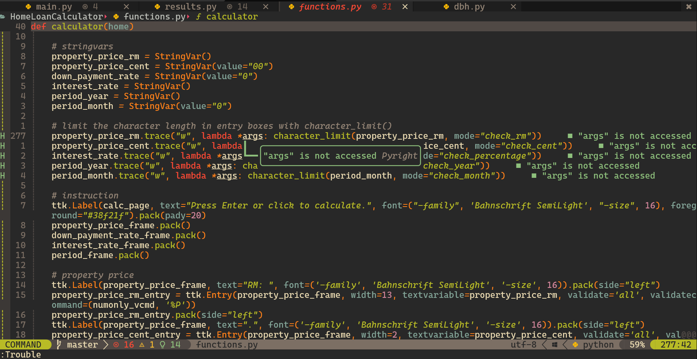
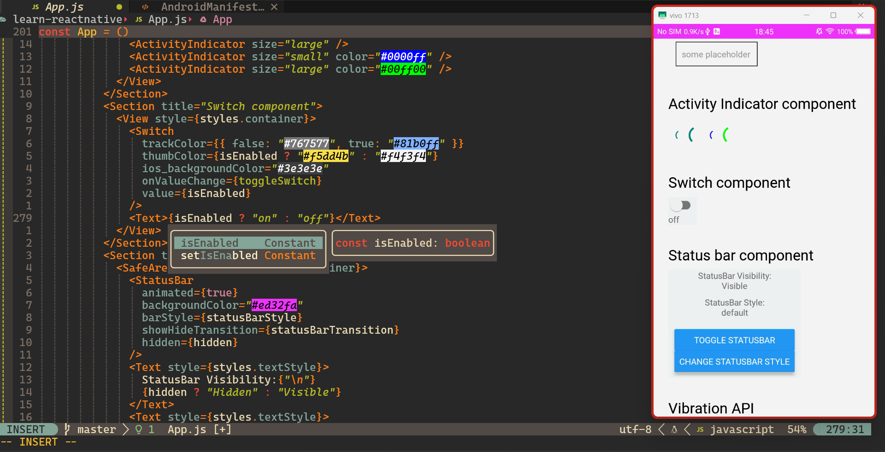

\

# for fresh install

1. [Download Packer](https://github.com/wbthomason/packer.nvim#quickstart)
   \
   `git clone https://github.com/wbthomason/packer.nvim "$env:LOCALAPPDATA\nvim-data\site\pack\packer\start\packer.nvim"`
2. Launch neovim.
3. `:PackerSync`
4. Restart neovim.

# to make changes to [`packer.lua`](https://github.com/devpandaz/nvim/blob/main/lua/devpandaz/packer.lua)

1. Go to
   [`lua/devpandaz/packer.lua`](https://github.com/devpandaz/nvim/blob/main/lua/devpandaz/packer.lua)
   and make the changes you want.
2. `:w` (save) and `:so` (source) it.
3. `:PackerInstall` or `:PackerUpdate` (if needed)
4. `:PackerCompile`
5. The changes would be applied when you launch neovim next time.

> ### `:h packer.compile()`
>
> You **must** call `compile` to update lazy-loaders after your configuration
> changes.

---

> note for myself: to lazy load plugins, must include either one lazy load
> config, e.g. `opt`, `cmd`, `ft`.\
> If for example `cmd` or `ft` is stated already, `opt` is not needed, but no
> harm in including too.

# to update any existing plugins setup file

1. Go to the plugin setup file that you want to edit, e.g.
   [`after/plugin/telescope.lua`](https://github.com/devpandaz/nvim/blob/main/after/plugin/telescope.lua).
2. Make your changes.
3. `:w` and `:so` to apply the changes immediately. If it does not work as
   intended, just restart neovim.

# to update all plugins

1. `:PackerSync` (avoid doing this if possible, causes a heavy load to the
   system)
